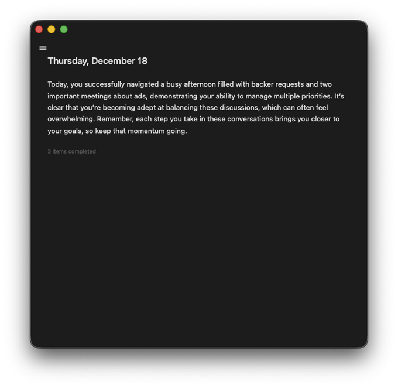
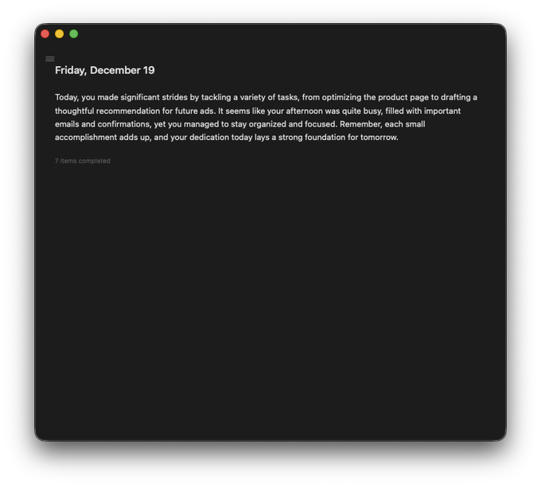
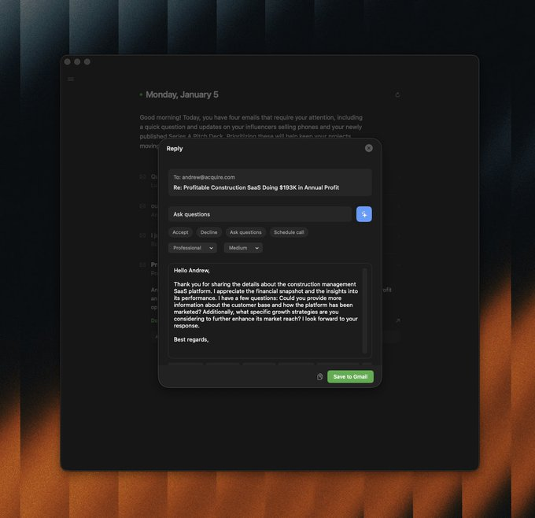
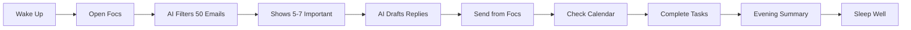

<div align="center">

# focs.

**One screen. Zero chaos.**

*Your daily priorities, distilled.*

[Live Demo](https://focs.vercel.app) • [Screenshots](#-screenshots) • [Quick Start](#-quick-start)

</div>

---

## 🎯 The Problem

Your morning routine: 47 unread emails. 12 calendar notifications. 3 Slack channels screaming. A todo app with 89 items. Anxiety rising.

**What if you could see only what matters?**

---

## ✨ The Solution

Focs is a PWA that reads your email and calendar, filters the noise with AI, and shows you 5-7 things that actually need your attention. That's it.

No tabs. No clutter. No guilt.

Just a calm, dark window that opens every morning with your priorities.

---

## 🧘 Philosophy

```
More tools ≠ More productivity
More focus = More done
```

Focs doesn't add to your stack. It replaces your morning chaos with one intentional screen.

---

## 🎨 What It Looks Like

<div align="center">

### Morning Brief


### AI Reply Drafts


### Evening Summary


</div>

---

## 🚀 Features That Matter

### 🤖 AI Email Filtering
Fetches 50 emails. Shows you 5-7. The rest? Newsletters, spam, noise—filtered automatically.

### ✍️ AI Reply Drafts
Click any email → AI writes a reply → Edit if needed → Send from Focs. No Gmail tab needed.

### 📅 Calendar Integration
Today's meetings, right there. Time, location, one-click join.

### 🌙 Evening Reflection
After 5 PM, see what you completed. No judgment, just data. Tomorrow is another day.

### 🔒 Privacy First
Your emails never leave your device. AI processing happens locally. No tracking, no analytics, no BS.

### 📱 True PWA
Install once. Opens like a native app. Works offline. No browser tabs.

---

## 🛠️ Tech Stack

**Frontend:** React 18 + TypeScript + Vite  
**Styling:** TailwindCSS + Framer Motion  
**Backend:** Firebase (Firestore + Auth)  
**AI:** Google Gemini 1.5 Flash  
**APIs:** Gmail + Google Calendar  
**PWA:** Vite PWA Plugin + Workbox  

---

## ⚡ Quick Start

### 1. Clone & Install
```bash
git clone https://github.com/devndesigner6/focs.git
cd focs
npm install
```

### 2. Setup Firebase
Create a Firebase project at [console.firebase.google.com](https://console.firebase.google.com)

Enable:
- Authentication → Google sign-in
- Firestore Database (test mode)

### 3. Setup Google Cloud
Go to [console.cloud.google.com](https://console.cloud.google.com)

Enable:
- Gmail API
- Google Calendar API

Create OAuth 2.0 credentials:
- Authorized redirect: `http://localhost:5173/auth/callback`

### 4. Get Gemini API Key
Visit [aistudio.google.com/apikey](https://aistudio.google.com/app/apikey)

Create API key (free tier: 60 req/min)

### 5. Configure Environment
Create `.env`:
```env
VITE_FIREBASE_API_KEY=your_firebase_key
VITE_FIREBASE_AUTH_DOMAIN=your_project.firebaseapp.com
VITE_FIREBASE_PROJECT_ID=your_project_id
VITE_FIREBASE_STORAGE_BUCKET=your_project.appspot.com
VITE_FIREBASE_MESSAGING_SENDER_ID=your_sender_id
VITE_FIREBASE_APP_ID=your_app_id

VITE_GOOGLE_CLIENT_ID=your_client_id.apps.googleusercontent.com
VITE_GOOGLE_CLIENT_SECRET=GOCSPX-your_secret

VITE_GEMINI_API_KEY=AIza...your_gemini_key
```

### 6. Run
```bash
npm run dev
```

Visit `http://localhost:5173`

---

## 📦 Deploy to Vercel

```bash
npm install -g vercel
vercel login
vercel
```

Add environment variables in Vercel dashboard.

Update OAuth redirect URI to: `https://your-app.vercel.app/auth/callback`

---

## 🎯 How It Works



---

## 🧩 Project Structure

```
focs/
├── src/
│   ├── components/
│   │   ├── EmailItemCard.tsx    # Email with AI draft
│   │   ├── EveningSummary.tsx   # 5 PM reflection
│   │   └── Settings.tsx         # Preferences
│   ├── pages/
│   │   ├── Landing.tsx          # Auth page
│   │   └── Brief.tsx            # Main brief view
│   ├── services/
│   │   ├── gmailService.ts      # Email fetching + filtering
│   │   ├── calendarService.ts   # Calendar events
│   │   ├── aiService.ts         # Gemini AI summaries
│   │   ├── draftService.ts      # AI reply generation
│   │   └── briefService.ts      # Brief orchestration
│   └── types/
│       └── index.ts             # TypeScript types
├── public/
│   ├── manifest.json            # PWA manifest
│   └── screenshots/             # App screenshots
└── vite.config.ts               # Vite + PWA config
```

---

## 🎨 Design Principles

1. **Dark by default** — Calm, focused, easy on eyes
2. **Retro typography** — Clean, readable, timeless
3. **Minimal animations** — Smooth, not distracting
4. **One action per screen** — No decision paralysis
5. **Offline-first** — Works without internet

---

## 🔐 Security & Privacy

- **No data collection** — We don't track anything
- **Local AI processing** — Emails analyzed on your device
- **Secure OAuth** — Google handles authentication
- **Firestore rules** — Only you can read your data
- **No third-party scripts** — Zero tracking pixels

---

## 📊 API Limits (Free Tier)

| Service | Limit | Cost |
|---------|-------|------|
| Gmail API | 1B quota units/day | Free |
| Calendar API | 1M queries/day | Free |
| Gemini API | 60 requests/min | Free |
| Firebase | 50K reads/day | Free |

**Translation:** You'll never hit these limits with normal use.

---

## 🐛 Troubleshooting

### "OAuth Error"
→ Check redirect URIs in Google Cloud Console  
→ Add test users to OAuth consent screen

### "No emails showing"
→ Delete today's brief from Firestore  
→ Refresh page to regenerate

### "AI drafts not appearing"
→ Check Gemini API key in `.env`  
→ Verify API quota not exceeded

### "Calendar events missing"
→ Ensure Calendar API is enabled  
→ Check OAuth scopes include calendar access

---

## 🎯 Roadmap

- [ ] Multi-account support (work + personal)
- [ ] Custom AI prompts for drafts
- [ ] Slack integration
- [ ] Mobile app (React Native)
- [ ] Voice commands
- [ ] Weekly/monthly summaries

---

## 🤝 Contributing

Found a bug? Have an idea? PRs welcome!

```bash
git checkout -b feature/your-feature
git commit -m "Add: your feature"
git push origin feature/your-feature
```

---

## 📜 License

MIT License — Use it, modify it, ship it.

---

## 💬 Philosophy

> "The ability to simplify means to eliminate the unnecessary so that the necessary may speak."  
> — Hans Hofmann

Focs is about elimination. Not addition.

We don't help you manage more. We help you need less.

---

<div align="center">

**Made with focus and calm** 🧘‍♂️

[⭐ Star on GitHub](https://github.com/devndesigner6/focs) • [🐛 Report Bug](https://github.com/devndesigner6/focs/issues) • [💡 Request Feature](https://github.com/devndesigner6/focs/issues)

</div>
